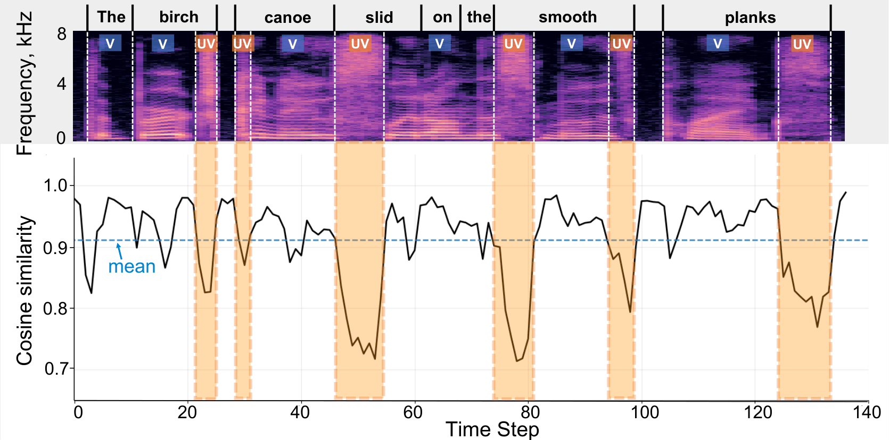
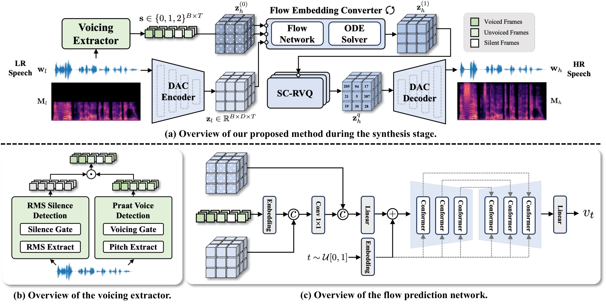
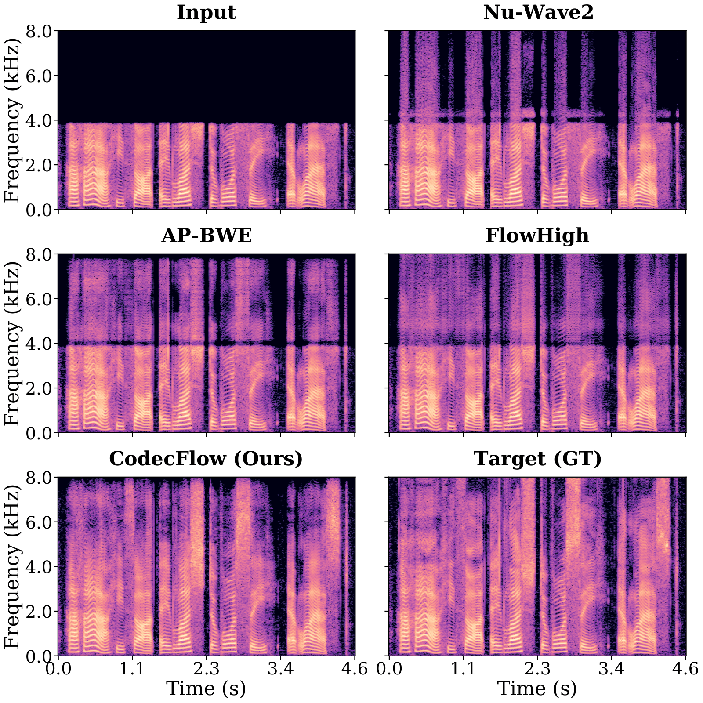
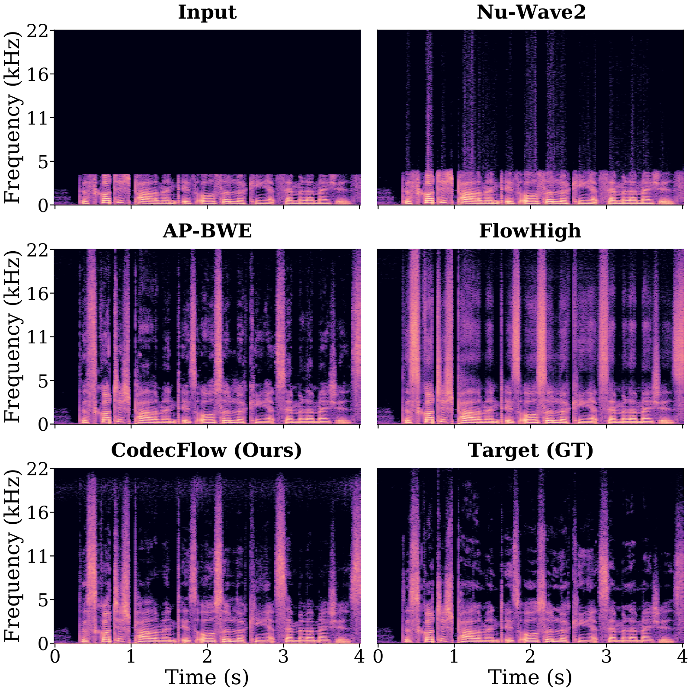

<h1 style="text-align: justify;">
CodecFlow: Efficient Bandwidth Extension via Conditional Flow Matching in Neural Codec Latent Space
</h1>

Paper Link: <a href="[https://arxiv.org/pdf/2509.19883](https://arxiv.org/pdf/2603.02022)" target="_blank">Arxiv</a>

## Abstract of the paper

Speech Bandwidth Extension improves clarity and intelligibility by restoring/inferring appropriate high-frequency content for low-bandwidth speech. Existing methods often rely on spectrogram or waveform modeling, which can incur higher computational cost and have limited high-frequency fidelity. Neural audio codecs offer compact latent representations that better preserve acoustic detail, yet accurately recovering high-resolution latent information remains challenging due to representation mismatch. We present CodecFlow, a neural codec-based BWE framework that performs efficient speech reconstruction in a compact latent space. CodecFlow employs a voicing-aware conditional flow converter on continuous codec embeddings and a structure-constrained residual vector quantizer to improve latent alignment stability. Optimized end-to-end, CodecFlow achieves strong spectral fidelity and enhanced perceptual quality on 8 kHz to 16 kHz and 44.1 kHz speech BWE tasks.

## Method
<figure style="text-align: center;">
    
    <figcaption style="text-align: justify; font-family: 'Times New Roman', 'SimSun', '宋体', serif;">
        <strong>V/UV segmentation and LR–HR embedding cosine similarity over time.</strong>
        Upper: spectrogram with word boundaries and V/UV labels. 
        Lower: cosine similarity; orange dashed regions mark UV-aligned drops, 
        blue dashed line shows the global mean.
    </figcaption>
</figure>

<figure style="text-align: center;">
    
    <figcaption style="text-align: justify; font-family: 'Times New Roman', 'SimSun', '宋体', serif;">
        <strong>An overview of the proposed CodecFlow framework.</strong>
        (a) the overall model pipeline, 
        (b) the architecture of the voicing extractor, and 
        (c) the architecture of the flow prediction network from the flow embedding converter (FEC).
    </figcaption>
</figure>

## Results
<figure style="text-align: center;">
    
    <figcaption style="text-align: justify; font-family: 'Times New Roman', 'SimSun', '宋体', serif;">
        <strong>Spectrogram comparisons for the 8 kHz to 16 kHz bandwidth expansion task.</strong> Spectrogram comparison between the 8 kHz input, the 16 kHz ground truth (GT), and model outputs, including NUWave2, AP-BWE, FlowHigh, and the proposed CodecFlow.
    </figcaption>
</figure>

<figure style="text-align: center;">
    
    <figcaption style="text-align: justify; font-family: 'Times New Roman', 'SimSun', '宋体', serif;">
        <strong>Spectrogram comparisons for the 8 kHz to 44.1 kHz bandwidth expansion task.</strong> Spectrogram comparison between the 8 kHz input, the 44.1 kHz ground truth (GT), and model outputs, including NUWave2, AP-BWE, FlowHigh, and the proposed CodecFlow.
    </figcaption>
</figure>

## Baseline Comparison

<table style="font-family: 'Times New Roman', 'SimSun', '宋体', serif;">
    <tbody>

        <tr style="background-color: #F0EFF8;">
          <td colspan="7" style="text-align: center; padding: 6px 10px; font-weight: bold;">
            Bandwidth Extension from 8 kHz to 16 kHz
          </td>
        </tr>

       <tr>
            <td nowrap>
Target
</td>
            <td>
Input
</td>
            <td>
Nu-Wave2
</td>
            <td>
AP-BWE
</td>
            <td>
Pre-Painter
</td>
           <td>
FlowHigh
</td>
           <td>
CodecFlow
</td>
        </tr>

        <tr>
            <td>
                <audio controls style="width: 130px;">
                  <source src="seen/demo-01/GT.wav" type="audio/mpeg">
                  Your browser does not support the audio tag.
                </audio>
            </td>
            <td>
                <audio controls style="width: 130px;">
                  <source src="seen/demo-01/Reference.wav" type="audio/mpeg">
                  Your browser does not support the audio tag.
                </audio>
            </td>
            <td>
                <audio controls style="width: 130px;">
                  <source src="seen/demo-01/maskgct.wav" type="audio/mpeg">
                  Your browser does not support the audio tag.
                </audio>
            </td>
            <td>
                <audio controls style="width: 130px;">
                  <source src="seen/demo-01/vevo.wav" type="audio/mpeg">
                  Your browser does not support the audio tag.
                </audio>
            </td>
            <td>
                <audio controls style="width: 130px;">
                  <source src="seen/demo-01/ours.wav" type="audio/mpeg">
                  Your browser does not support the audio tag.
                </audio>
            </td>
            <td>
                <audio controls style="width: 130px;">
                  <source src="seen/demo-01/GT.wav" type="audio/mpeg">
                  Your browser does not support the audio tag.
                </audio>
            </td>
            <td>
                <audio controls style="width: 130px;">
                  <source src="seen/demo-01/GT.wav" type="audio/mpeg">
                  Your browser does not support the audio tag.
                </audio>
            </td>
        </tr>

        <tr>
            <td>

</td>
            <td>

</td>
            <td>

</td>
            <td>

</td>
            <td>

</td>
            <td>

</td>
            <td>

</td>
        </tr>

        <tr>
            <td>
                <audio controls style="width: 130px;">
                  <source src="seen/demo-01/GT.wav" type="audio/mpeg">
                  Your browser does not support the audio tag.
                </audio>
            </td>
            <td>
                <audio controls style="width: 130px;">
                  <source src="seen/demo-01/Reference.wav" type="audio/mpeg">
                  Your browser does not support the audio tag.
                </audio>
            </td>
            <td>
                <audio controls style="width: 130px;">
                  <source src="seen/demo-01/maskgct.wav" type="audio/mpeg">
                  Your browser does not support the audio tag.
                </audio>
            </td>
            <td>
                <audio controls style="width: 130px;">
                  <source src="seen/demo-01/vevo.wav" type="audio/mpeg">
                  Your browser does not support the audio tag.
                </audio>
            </td>
            <td>
                <audio controls style="width: 130px;">
                  <source src="seen/demo-01/ours.wav" type="audio/mpeg">
                  Your browser does not support the audio tag.
                </audio>
            </td>
            <td>
                <audio controls style="width: 130px;">
                  <source src="seen/demo-01/GT.wav" type="audio/mpeg">
                  Your browser does not support the audio tag.
                </audio>
            </td>
            <td>
                <audio controls style="width: 130px;">
                  <source src="seen/demo-01/GT.wav" type="audio/mpeg">
                  Your browser does not support the audio tag.
                </audio>
            </td>
        </tr>

        <tr>
            <td>

</td>
            <td>

</td>
            <td>

</td>
            <td>

</td>
            <td>

</td>
            <td>

</td>
            <td>

</td>
        </tr>

        <tr style="background-color: #F0EFF8;">
          <td colspan="7" style="text-align: center; padding: 6px 10px; font-weight: bold;">
            Bandwidth Extension from 8 kHz to 44.1 kHz
          </td>
        </tr>

       <tr>
            <td nowrap>
Target
</td>
            <td>
Input
</td>
            <td>
Nu-Wave2
</td>
            <td>
AP-BWE
</td>
            <td>
Pre-Painter
</td>
           <td>
FlowHigh
</td>
           <td>
CodecFlow
</td>
        </tr>

        <tr>
            <td>
                <audio controls style="width: 130px;">
                  <source src="seen/demo-01/GT.wav" type="audio/mpeg">
                  Your browser does not support the audio tag.
                </audio>
            </td>
            <td>
                <audio controls style="width: 130px;">
                  <source src="seen/demo-01/Reference.wav" type="audio/mpeg">
                  Your browser does not support the audio tag.
                </audio>
            </td>
            <td>
                <audio controls style="width: 130px;">
                  <source src="seen/demo-01/maskgct.wav" type="audio/mpeg">
                  Your browser does not support the audio tag.
                </audio>
            </td>
            <td>
                <audio controls style="width: 130px;">
                  <source src="seen/demo-01/vevo.wav" type="audio/mpeg">
                  Your browser does not support the audio tag.
                </audio>
            </td>
            <td>
                <audio controls style="width: 130px;">
                  <source src="seen/demo-01/ours.wav" type="audio/mpeg">
                  Your browser does not support the audio tag.
                </audio>
            </td>
            <td>
                <audio controls style="width: 130px;">
                  <source src="seen/demo-01/GT.wav" type="audio/mpeg">
                  Your browser does not support the audio tag.
                </audio>
            </td>
            <td>
                <audio controls style="width: 130px;">
                  <source src="seen/demo-01/GT.wav" type="audio/mpeg">
                  Your browser does not support the audio tag.
                </audio>
            </td>
        </tr>

        <tr>
            <td>

</td>
            <td>

</td>
            <td>

</td>
            <td>

</td>
            <td>

</td>
            <td>

</td>
            <td>

</td>
        </tr>

        <tr>
            <td>
                <audio controls style="width: 130px;">
                  <source src="seen/demo-01/GT.wav" type="audio/mpeg">
                  Your browser does not support the audio tag.
                </audio>
            </td>
            <td>
                <audio controls style="width: 130px;">
                  <source src="seen/demo-01/Reference.wav" type="audio/mpeg">
                  Your browser does not support the audio tag.
                </audio>
            </td>
            <td>
                <audio controls style="width: 130px;">
                  <source src="seen/demo-01/maskgct.wav" type="audio/mpeg">
                  Your browser does not support the audio tag.
                </audio>
            </td>
            <td>
                <audio controls style="width: 130px;">
                  <source src="seen/demo-01/vevo.wav" type="audio/mpeg">
                  Your browser does not support the audio tag.
                </audio>
            </td>
            <td>
                <audio controls style="width: 130px;">
                  <source src="seen/demo-01/ours.wav" type="audio/mpeg">
                  Your browser does not support the audio tag.
                </audio>
            </td>
            <td>
                <audio controls style="width: 130px;">
                  <source src="seen/demo-01/GT.wav" type="audio/mpeg">
                  Your browser does not support the audio tag.
                </audio>
            </td>
            <td>
                <audio controls style="width: 130px;">
                  <source src="seen/demo-01/GT.wav" type="audio/mpeg">
                  Your browser does not support the audio tag.
                </audio>
            </td>
        </tr>

        <tr>
            <td>

</td>
            <td>

</td>
            <td>

</td>
            <td>

</td>
            <td>

</td>
            <td>

</td>
            <td>

</td>
        </tr>
    </tbody>
</table>

  <!-- 箭头提示 -->
  

    →
  

  
  

## Ablation Study
<table style="font-family: 'Times New Roman', 'SimSun', '宋体', serif; width: 100%; max-width: 100%;  border-collapse: collapse;">
    <tbody>
       <tr style="background-color: #EAF2E8;">
          <td colspan="5" style="text-align: center; padding: 6px 10px; font-weight: bold;">
            Male Singer 1: Danny
          </td>
        </tr>
        <tr>
            <td>
Reference
</td>
            <td>
MaskGCT
</td>
            <td>
Vevo 1.5
</td>
           <td>
CoMelSinger
</td>
        </tr>

        <tr style="background-color: #F0EFF8;">
          <td colspan="5" style="text-align: left; padding: 6px 10px; font-weight: 500;">
            早 (G3) 些 (G3) 少 (A3) 年 (E3) 时 (G3) | zao xie shao nian shi
          </td>
        </tr>
        <tr>
            <td>
                <audio controls style="width: 170px;">
                  <source src="unseen/m1/demo-01/reference.wav" type="audio/mpeg">
                  Your browser does not support the audio tag.
                </audio>
            </td>
            <td>
                <audio controls style="width: 170px;">
                  <source src="unseen/m1/demo-01/maskgct.wav" type="audio/mpeg">
                  Your browser does not support the audio tag.
                </audio>
            </td>
            <td>
                <audio controls style="width: 170px;">
                  <source src="unseen/m1/demo-01/vevo.wav" type="audio/mpeg">
                  Your browser does not support the audio tag.
                </audio>
            </td>
            <td>
                <audio controls style="width: 170px;">
                  <source src="unseen/m1/demo-01/ours.wav" type="audio/mpeg">
                  Your browser does not support the audio tag.
                </audio>
            </td>
        </tr>

        <tr style="background-color: #F0EFF8;">
          <td colspan="5" style="text-align: left; padding: 6px 10px; font-weight: 500;">
            痛 (A2) 太 (C3) 美 (D3)，尽 (A2) 管 (C3) 再 (D3) 卑 (G2) 微 (F2) | tong tai mei, jin guan zai bei wei
          </td>
        </tr>
        <tr>
            <td>
                <audio controls style="width: 170px;">
                  <source src="unseen/m1/demo-02/reference.wav" type="audio/mpeg">
                  Your browser does not support the audio tag.
                </audio>
            </td>
            <td>
                <audio controls style="width: 170px;">
                  <source src="unseen/m1/demo-02/maskgct.wav" type="audio/mpeg">
                  Your browser does not support the audio tag.
                </audio>
            </td>
            <td>
                <audio controls style="width: 170px;">
                  <source src="unseen/m1/demo-02/vevo.wav" type="audio/mpeg">
                  Your browser does not support the audio tag.
                </audio>
            </td>
            <td>
                <audio controls style="width: 170px;">
                  <source src="unseen/m1/demo-02/ours.wav" type="audio/mpeg">
                  Your browser does not support the audio tag.
                </audio>
            </td>
        </tr>

        <tr style="background-color: #F0EFF8;">
          <td colspan="5" style="text-align: left; padding: 6px 10px; font-weight: 500;">
            多 (A2) 吹 (A2) 一 (B2) 些 (D3) 风 (G2) | duo chui yi xie feng
          </td>
        </tr>
        <tr>
            <td>
                <audio controls style="width: 170px;">
                  <source src="unseen/m1/demo-03/reference.wav" type="audio/mpeg">
                  Your browser does not support the audio tag.
                </audio>
            </td>
            <td>
                <audio controls style="width: 170px;">
                  <source src="unseen/m1/demo-03/maskgct.wav" type="audio/mpeg">
                  Your browser does not support the audio tag.
                </audio>
            </td>
            <td>
                <audio controls style="width: 170px;">
                  <source src="unseen/m1/demo-03/vevo.wav" type="audio/mpeg">
                  Your browser does not support the audio tag.
                </audio>
            </td>
            <td>
                <audio controls style="width: 170px;">
                  <source src="unseen/m1/demo-03/ours.wav" type="audio/mpeg">
                  Your browser does not support the audio tag.
                </audio>
            </td>
        </tr>
    </tbody>
        
</table>

<table style="font-family: 'Times New Roman', 'SimSun', '宋体', serif; table-layout: fixed;">
    <colgroup>
        <col width="170">
        <col width="170">
        <col width="170">
        <col width="170">
      </colgroup>
    <tbody>
       <tr style="background-color: #EAF2E8;">
          <td colspan="5" style="text-align: center; padding: 6px 10px; font-weight: bold;">
            Male Singer 2: Wei
          </td>
        </tr>
        <tr>
            <td>
Reference
</td>
            <td>
MaskGCT
</td>
            <td>
Vevo 1.5
</td>
           <td>
CoMelSinger
</td>
        </tr>

        <tr style="background-color: #F0EFF8;">
          <td colspan="5" style="text-align: left; padding: 6px 10px; font-weight: 500; word-break: break-word;
      overflow-wrap: break-word;
      white-space: normal;">
            每 (D#3) 一 (F#3) 滴 (B3) 泪 (A#3) 水 (D#3)，都 (D#3) 向 (C#3) 你 (B2) 流 (B2) 淌 (C#3) 去 (D#3) | mei yi di lei shui, dou xiang ni liu tang qu
          </td>
        </tr>
        <tr>
            <td>
                <audio controls style="width: 170px;">
                  <source src="unseen/m2/demo-01/reference.wav" type="audio/mpeg">
                  Your browser does not support the audio tag.
                </audio>
            </td>
            <td>
                <audio controls style="width: 170px;">
                  <source src="unseen/m2/demo-01/maskgct.wav" type="audio/mpeg">
                  Your browser does not support the audio tag.
                </audio>
            </td>
            <td>
                <audio controls style="width: 170px;">
                  <source src="unseen/m2/demo-01/vevo.wav" type="audio/mpeg">
                  Your browser does not support the audio tag.
                </audio>
            </td>
            <td>
                <audio controls style="width: 170px;">
                  <source src="unseen/m2/demo-01/ours.wav" type="audio/mpeg">
                  Your browser does not support the audio tag.
                </audio>
            </td>
        </tr>

        <tr style="background-color: #F0EFF8;">
          <td colspan="5" style="text-align: left; padding: 6px 10px; font-weight: 500; word-break: break-word;
      overflow-wrap: break-word;
      white-space: normal;">
            现 (D3) 在 (F3) 我 (G3) 想 (Bb3) 问 (A3) 问 (D3) 你 (Bb3) | xian zai wo xiang wen wen ni
          </td>
        </tr>
        <tr>
            <td>
                <audio controls style="width: 170px;">
                  <source src="unseen/m2/demo-02/reference.wav" type="audio/mpeg">
                  Your browser does not support the audio tag.
                </audio>
            </td>
            <td>
                <audio controls style="width: 170px;">
                  <source src="unseen/m2/demo-02/maskgct.wav" type="audio/mpeg">
                  Your browser does not support the audio tag.
                </audio>
            </td>
            <td>
                <audio controls style="width: 170px;">
                  <source src="unseen/m2/demo-02/vevo.wav" type="audio/mpeg">
                  Your browser does not support the audio tag.
                </audio>
            </td>
            <td>
                <audio controls style="width: 170px;">
                  <source src="unseen/m2/demo-02/ours.wav" type="audio/mpeg">
                  Your browser does not support the audio tag.
                </audio>
            </td>
        </tr>

        <tr style="background-color: #F0EFF8;">
          <td colspan="5" style="text-align: left; padding: 6px 10px; font-weight: 500; word-break: break-word;
      overflow-wrap: break-word;
      white-space: normal;">
            烛 (C3) 光 (D3) 照 (F3) 亮 (G3) 了 (F3) 晚 (G3) 餐 (A3)，照 (A3) 不 (A3) 出 (G3) 个 (F3) 答 (G3) 案 (A3) ｜ zhu guang zhao liang le wan can, zhao bu chu ge da an
          </td>
        </tr>
        <tr>
            <td>
                <audio controls style="width: 170px;">
                  <source src="unseen/m2/demo-03/reference.wav" type="audio/mpeg">
                  Your browser does not support the audio tag.
                </audio>
            </td>
            <td>
                <audio controls style="width: 170px;">
                  <source src="unseen/m2/demo-03/maskgct.wav" type="audio/mpeg">
                  Your browser does not support the audio tag.
                </audio>
            </td>
            <td>
                <audio controls style="width: 170px;">
                  <source src="unseen/m2/demo-03/vevo.wav" type="audio/mpeg">
                  Your browser does not support the audio tag.
                </audio>
            </td>
            <td>
                <audio controls style="width: 170px;">
                  <source src="unseen/m2/demo-03/ours.wav" type="audio/mpeg">
                  Your browser does not support the audio tag.
                </audio>
            </td>
        </tr>
    </tbody>
        
</table>

<table style="font-family: 'Times New Roman', 'SimSun', '宋体', serif;">
    <tbody>
    <colgroup>
        <col width="170">
        <col width="170">
        <col width="170">
        <col width="170">
      </colgroup>
       <tr style="background-color: #EAF2E8;">
          <td colspan="5" style="text-align: center; padding: 6px 10px; font-weight: bold;">
            Female Singer 1: Sveta
          </td>
        </tr>
        <tr>
            <td>
Reference
</td>
            <td>
MaskGCT
</td>
            <td>
Vevo 1.5
</td>
           <td>
CoMelSinger
</td>
        </tr>

        <tr style="background-color: #F0EFF8;">
          <td colspan="5" style="text-align: left; padding: 6px 10px; font-weight: 500;">
            刻 (F4) 在 (F4) 我 (F3) 心 (Eb4) 底 (D4) 的 (D4) 名 (C4) 字 (D4) | ke zai wo xin di de ming zi
          </td>
        </tr>
        <tr>
            <td>
                <audio controls style="width: 170px;">
                  <source src="unseen/f1/demo-01/reference.wav" type="audio/mpeg">
                  Your browser does not support the audio tag.
                </audio>
            </td>
            <td>
                <audio controls style="width: 170px;">
                  <source src="unseen/f1/demo-01/maskgct.wav" type="audio/mpeg">
                  Your browser does not support the audio tag.
                </audio>
            </td>
            <td>
                <audio controls style="width: 170px;">
                  <source src="unseen/f1/demo-01/vevo.wav" type="audio/mpeg">
                  Your browser does not support the audio tag.
                </audio>
            </td>
            <td>
                <audio controls style="width: 170px;">
                  <source src="unseen/f1/demo-01/ours.wav" type="audio/mpeg">
                  Your browser does not support the audio tag.
                </audio>
            </td>
        </tr>

        <tr style="background-color: #F0EFF8;">
          <td colspan="5" style="text-align: left; padding: 6px 10px; font-weight: 500;">
            刻 (D4) 骨 (C4) 铭 (Eb4) 心 (D4) 只 (C4) 有 (Bb3) 我 (C3) 自 (Bb3) 己 (F3) | ke gu ming xin zhi you wo zi ji
          </td>
        </tr>
        <tr>
            <td>
                <audio controls style="width: 170px;">
                  <source src="unseen/f1/demo-02/reference.wav" type="audio/mpeg">
                  Your browser does not support the audio tag.
                </audio>
            </td>
            <td>
                <audio controls style="width: 170px;">
                  <source src="unseen/f1/demo-02/maskgct.wav" type="audio/mpeg">
                  Your browser does not support the audio tag.
                </audio>
            </td>
            <td>
                <audio controls style="width: 170px;">
                  <source src="unseen/f1/demo-02/vevo.wav" type="audio/mpeg">
                  Your browser does not support the audio tag.
                </audio>
            </td>
            <td>
                <audio controls style="width: 170px;">
                  <source src="unseen/f1/demo-02/ours.wav" type="audio/mpeg">
                  Your browser does not support the audio tag.
                </audio>
            </td>
        </tr>

        <tr style="background-color: #F0EFF8;">
          <td colspan="5" style="text-align: left; padding: 6px 10px; font-weight: 500;">
            我 (A3) 们 (E4) 改 (E4) 变 (E4) 了 (D4) 态 (E4) 度 (D4) 接 (E4) 纳 (D4) 了 (E4) 对 (D4) 方 (D4) ｜ wo men gai bian le tai du jie na le dui fang
          </td>
        </tr>
        <tr>
            <td>
                <audio controls style="width: 170px;">
                  <source src="unseen/f1/demo-03/reference.wav" type="audio/mpeg">
                  Your browser does not support the audio tag.
                </audio>
            </td>
            <td>
                <audio controls style="width: 170px;">
                  <source src="unseen/f1/demo-03/maskgct.wav" type="audio/mpeg">
                  Your browser does not support the audio tag.
                </audio>
            </td>
            <td>
                <audio controls style="width: 170px;">
                  <source src="unseen/f1/demo-03/vevo.wav" type="audio/mpeg">
                  Your browser does not support the audio tag.
                </audio>
            </td>
            <td>
                <audio controls style="width: 170px;">
                  <source src="unseen/f1/demo-03/ours.wav" type="audio/mpeg">
                  Your browser does not support the audio tag.
                </audio>
            </td>
        </tr>
    </tbody>
        
</table>

<table style="font-family: 'Times New Roman', 'SimSun', '宋体', serif;">
    <tbody>
        <colgroup>
        <col width="170">
        <col width="170">
        <col width="170">
        <col width="170">
      </colgroup>
       <tr style="background-color: #EAF2E8;">
          <td colspan="5" style="text-align: center; padding: 6px 10px; font-weight: bold;">
            Female Singer 2: Mian-Mian
          </td>
        </tr>
        <tr>
            <td>
Reference
</td>
            <td>
MaskGCT
</td>
            <td>
Vevo 1.5
</td>
           <td>
CoMelSinger
</td>
        </tr>

        <tr style="background-color: #F0EFF8;">
          <td colspan="5" style="text-align: left; padding: 6px 10px; font-weight: 500;">
            一 (C#4) 寸 (D4) 一 (C#4) 寸 (D4) 填 (F#4) 满 (G3) 欲 (E3) 望 (D3) ｜ yi cun yi cun tian man yu wang
          </td>
        </tr>
        <tr>
            <td>
                <audio controls style="width: 170px;">
                  <source src="unseen/f2/demo-01/reference.wav" type="audio/mpeg">
                  Your browser does not support the audio tag.
                </audio>
            </td>
            <td>
                <audio controls style="width: 170px;">
                  <source src="unseen/f2/demo-01/maskgct.wav" type="audio/mpeg">
                  Your browser does not support the audio tag.
                </audio>
            </td>
            <td>
                <audio controls style="width: 170px;">
                  <source src="unseen/f2/demo-01/vevo.wav" type="audio/mpeg">
                  Your browser does not support the audio tag.
                </audio>
            </td>
            <td>
                <audio controls style="width: 170px;">
                  <source src="unseen/f2/demo-01/ours.wav" type="audio/mpeg">
                  Your browser does not support the audio tag.
                </audio>
            </td>
        </tr>

        <tr style="background-color: #F0EFF8;">
          <td colspan="5" style="text-align: left; padding: 6px 10px; font-weight: 500;">
            只 (Ab3) 是 (Bb3) 哪 (C4) 怕 (Bb3) 周 (C4) 围 (Bb3) 再 (C4) 多 (F4) 人 (C4) | zhi shi na pa zhou wei zai duo ren
          </td>
        </tr>
        <tr>
            <td>
                <audio controls style="width: 170px;">
                  <source src="unseen/f2/demo-02/reference.wav" type="audio/mpeg">
                  Your browser does not support the audio tag.
                </audio>
            </td>
            <td>
                <audio controls style="width: 170px;">
                  <source src="unseen/f2/demo-02/maskgct.wav" type="audio/mpeg">
                  Your browser does not support the audio tag.
                </audio>
            </td>
            <td>
                <audio controls style="width: 170px;">
                  <source src="unseen/f2/demo-02/vevo.wav" type="audio/mpeg">
                  Your browser does not support the audio tag.
                </audio>
            </td>
            <td>
                <audio controls style="width: 170px;">
                  <source src="unseen/f2/demo-02/ours.wav" type="audio/mpeg">
                  Your browser does not support the audio tag.
                </audio>
            </td>
        </tr>

        <tr style="background-color: #F0EFF8;">
          <td colspan="5" style="text-align: left; padding: 6px 10px; font-weight: 500;">
            所 (E4) 有 (F#4) 人 (E4) 都 (D4) 遗 (C#4) 忘 (B3) 了 (E4) 我 (C#4) | suo you ren dou yi wang le wo
          </td>
        </tr>
        <tr>
            <td>
                <audio controls style="width: 170px;">
                  <source src="unseen/f2/demo-03/reference.wav" type="audio/mpeg">
                  Your browser does not support the audio tag.
                </audio>
            </td>
            <td>
                <audio controls style="width: 170px;">
                  <source src="unseen/f2/demo-03/maskgct.wav" type="audio/mpeg">
                  Your browser does not support the audio tag.
                </audio>
            </td>
            <td>
                <audio controls style="width: 170px;">
                  <source src="unseen/f2/demo-03/vevo.wav" type="audio/mpeg">
                  Your browser does not support the audio tag.
                </audio>
            </td>
            <td>
                <audio controls style="width: 170px;">
                  <source src="unseen/f2/demo-03/ours.wav" type="audio/mpeg">
                  Your browser does not support the audio tag.
                </audio>
            </td>
        </tr>
    </tbody>
        
</table>

