<h1 style="text-align: justify;">
CodecFlow: Efficient Bandwidth Extension via Conditional Flow Matching in Neural Codec Latent Space
</h1>

Paper Link: <a href="[https://arxiv.org/pdf/2509.19883](https://arxiv.org/pdf/2603.02022)" target="_blank">Arxiv</a>

## Abstract of the paper

Speech Bandwidth Extension improves clarity and intelligibility by restoring/inferring appropriate high-frequency content for low-bandwidth speech. Existing methods often rely on spectrogram or waveform modeling, which can incur higher computational cost and have limited high-frequency fidelity. Neural audio codecs offer compact latent representations that better preserve acoustic detail, yet accurately recovering high-resolution latent information remains challenging due to representation mismatch. We present CodecFlow, a neural codec-based BWE framework that performs efficient speech reconstruction in a compact latent space. CodecFlow employs a voicing-aware conditional flow converter on continuous codec embeddings and a structure-constrained residual vector quantizer to improve latent alignment stability. Optimized end-to-end, CodecFlow achieves strong spectral fidelity and enhanced perceptual quality on 8 kHz to 16 kHz and 44.1 kHz speech BWE tasks.

## Method
<figure style="text-align: center;">
    
    <figcaption style="text-align: justify; font-family: 'Times New Roman', 'SimSun', '宋体', serif;">
        <strong>V/UV segmentation and LR–HR embedding cosine similarity over time.</strong>
        Upper: spectrogram with word boundaries and V/UV labels. 
        Lower: cosine similarity; orange dashed regions mark UV-aligned drops, 
        blue dashed line shows the global mean.
    </figcaption>
</figure>

<figure style="text-align: center;">
    
    <figcaption style="text-align: justify; font-family: 'Times New Roman', 'SimSun', '宋体', serif;">
        <strong>An overview of the proposed CodecFlow framework.</strong>
        (a) the overall model pipeline, 
        (b) the architecture of the voicing extractor, and 
        (c) the architecture of the flow prediction network from the flow embedding converter (FEC).
    </figcaption>
</figure>

## Results
<figure style="text-align: center;">
    
    <figcaption style="text-align: justify; font-family: 'Times New Roman', 'SimSun', '宋体', serif;">
        <strong>Spectrogram comparisons for the 8 kHz to 16 kHz bandwidth expansion task.</strong> Spectrogram comparison between the 8 kHz input, the 16 kHz ground truth (GT), and model outputs, including NUWave2, AP-BWE, FlowHigh, and the proposed CodecFlow.
    </figcaption>
</figure>

<figure style="text-align: center;">
    
    <figcaption style="text-align: justify; font-family: 'Times New Roman', 'SimSun', '宋体', serif;">
        <strong>Spectrogram comparisons for the 8 kHz to 44.1 kHz bandwidth expansion task.</strong> Spectrogram comparison between the 8 kHz input, the 44.1 kHz ground truth (GT), and model outputs, including NUWave2, AP-BWE, FlowHigh, and the proposed CodecFlow.
    </figcaption>
</figure>

## Baseline Comparison

<table style="font-family: 'Times New Roman', 'SimSun', '宋体', serif;">
    <tbody>

        <tr style="background-color: #F0EFF8;">
          <td colspan="7" style="text-align: center; padding: 6px 10px; font-weight: bold;">
            Bandwidth Extension from 8 kHz to 16 kHz
          </td>
        </tr>

       <tr>
            <td nowrap>
Target
</td>
            <td>
Input
</td>
            <td>
Nu-Wave2
</td>
            <td>
AP-BWE
</td>
            <td>
Fre-Painter
</td>
           <td>
FlowHigh
</td>
           <td>
CodecFlow
</td>
        </tr>

        <tr>
            <td>
                <audio controls style="width: 130px;">
                  <source src="16k/gt/fsem0_si1828.wav" type="audio/mpeg">
                  Your browser does not support the audio tag.
                </audio>
            </td>
            <td>
                <audio controls style="width: 130px;">
                  <source src="16k/input/fsem0_si1828_8k.wav" type="audio/mpeg">
                  Your browser does not support the audio tag.
                </audio>
            </td>
            <td>
                <audio controls style="width: 130px;">
                  <source src="16k/nuwave2/fsem0_si1828_nuwave2.wav" type="audio/mpeg">
                  Your browser does not support the audio tag.
                </audio>
            </td>
            <td>
                <audio controls style="width: 130px;">
                  <source src="16k/APBWE/fsem0_si1828_8k.wav" type="audio/mpeg">
                  Your browser does not support the audio tag.
                </audio>
            </td>
            <td>
                <audio controls style="width: 130px;">
                  <source src="16k/FrePainter/fsem0_si1828_8k.wav" type="audio/mpeg">
                  Your browser does not support the audio tag.
                </audio>
            </td>
            <td>
                <audio controls style="width: 130px;">
                  <source src="16k/flowhigh/fsem0_si1828_8k.wav" type="audio/mpeg">
                  Your browser does not support the audio tag.
                </audio>
            </td>
            <td>
                <audio controls style="width: 130px;">
                  <source src="16k/CodecFlow/fsem0_si1828.wav" type="audio/mpeg">
                  Your browser does not support the audio tag.
                </audio>
            </td>
        </tr>

        <tr>
            <td>

</td>
            <td>

</td>
            <td>
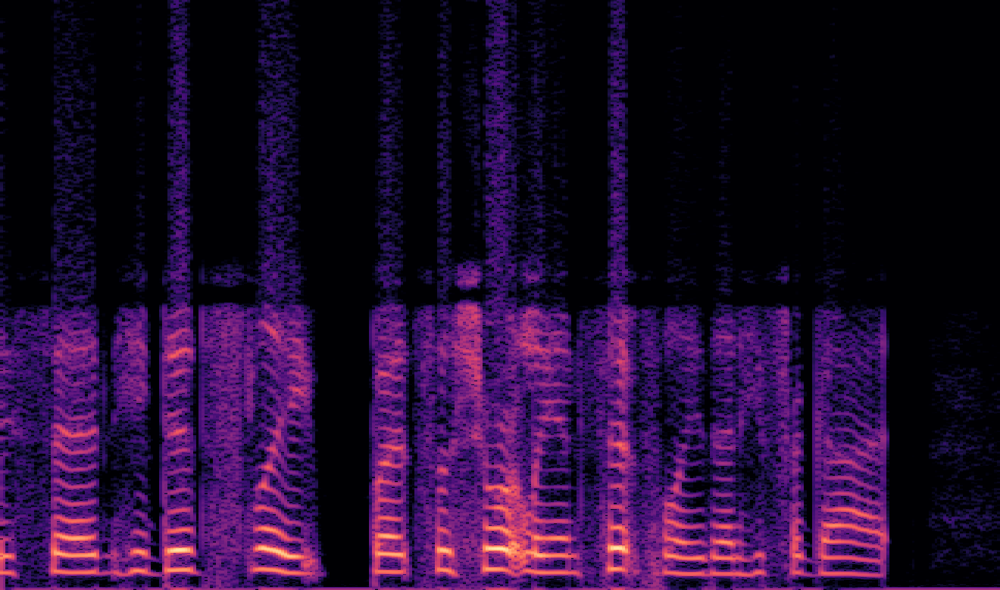
</td>
            <td>
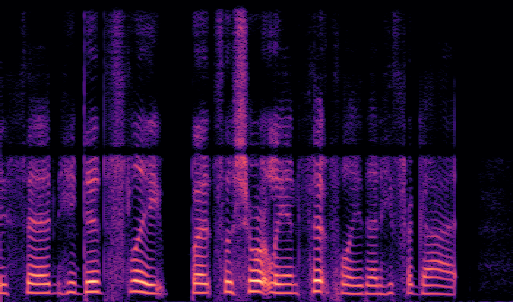
</td>
            <td>
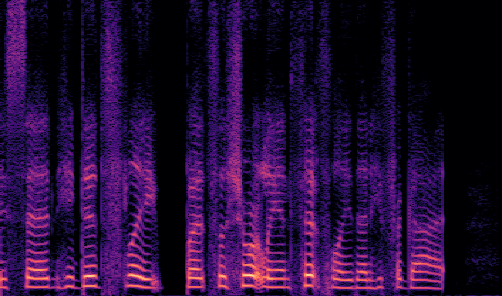
</td>
            <td>
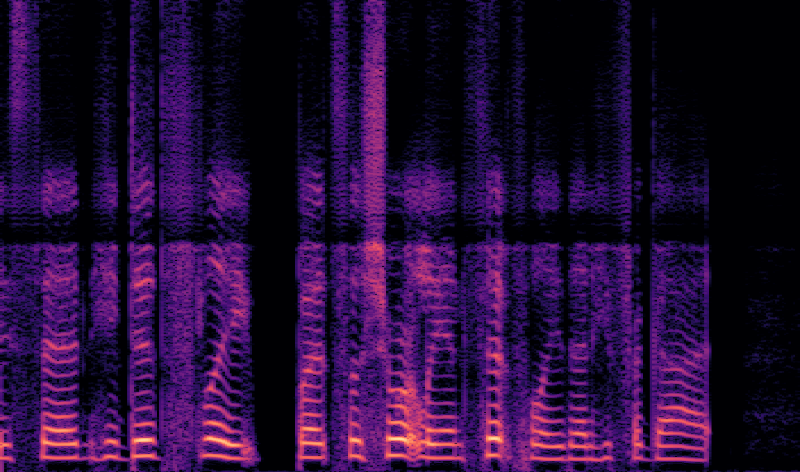
</td>
            <td>
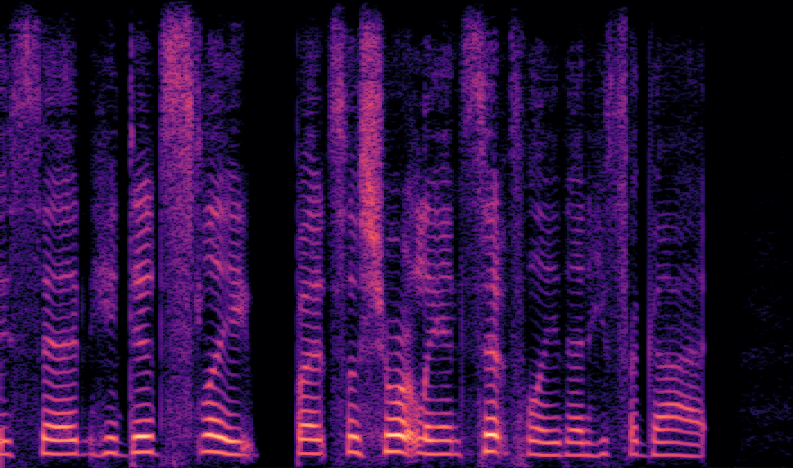
</td>
        </tr>

        <tr>
            <td>
                <audio controls style="width: 130px;">
                  <source src="16k/gt/mbdg0_si1463.wav" type="audio/mpeg">
                  Your browser does not support the audio tag.
                </audio>
            </td>
            <td>
                <audio controls style="width: 130px;">
                  <source src="16k/input/mbdg0_si1463_8k.wav" type="audio/mpeg">
                  Your browser does not support the audio tag.
                </audio>
            </td>
            <td>
                <audio controls style="width: 130px;">
                  <source src="16k/nuwave2/mbdg0_si1463_nuwave2.wav" type="audio/mpeg">
                  Your browser does not support the audio tag.
                </audio>
            </td>
            <td>
                <audio controls style="width: 130px;">
                  <source src="16k/APBWE/mbdg0_si1463_8k.wav" type="audio/mpeg">
                  Your browser does not support the audio tag.
                </audio>
            </td>
            <td>
                <audio controls style="width: 130px;">
                  <source src="16k/FrePainter/mbdg0_si1463_8k.wav" type="audio/mpeg">
                  Your browser does not support the audio tag.
                </audio>
            </td>
            <td>
                <audio controls style="width: 130px;">
                  <source src="16k/flowhigh/mbdg0_si1463_8k.wav" type="audio/mpeg">
                  Your browser does not support the audio tag.
                </audio>
            </td>
            <td>
                <audio controls style="width: 130px;">
                  <source src="16k/CodecFlow/mbdg0_si1463.wav" type="audio/mpeg">
                  Your browser does not support the audio tag.
                </audio>
            </td>
        </tr>

        <tr>
            <td>
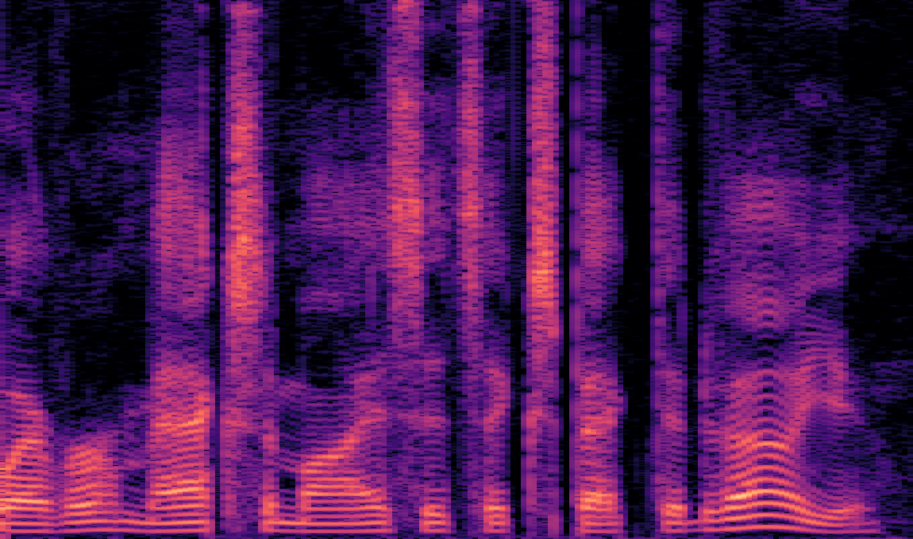
</td>
            <td>
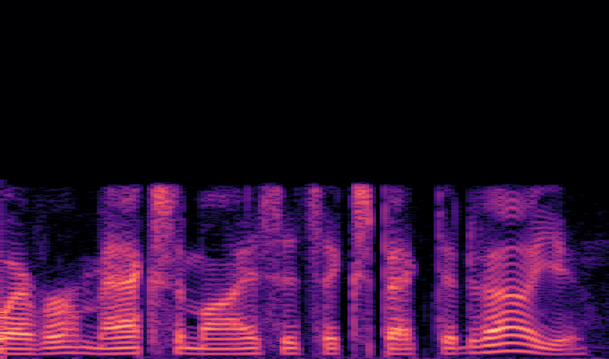
</td>
            <td>
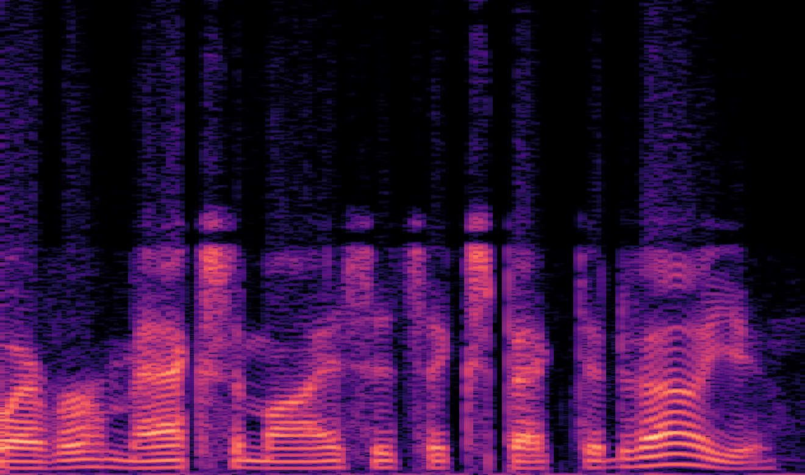
</td>
            <td>
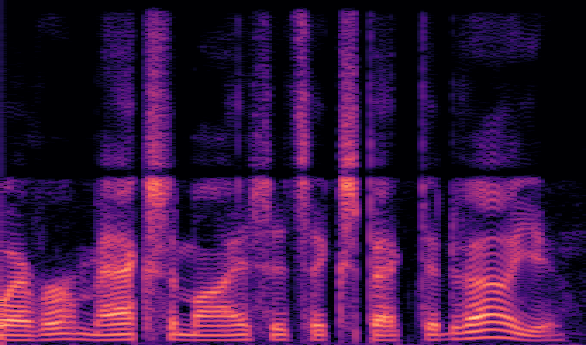
</td>
            <td>
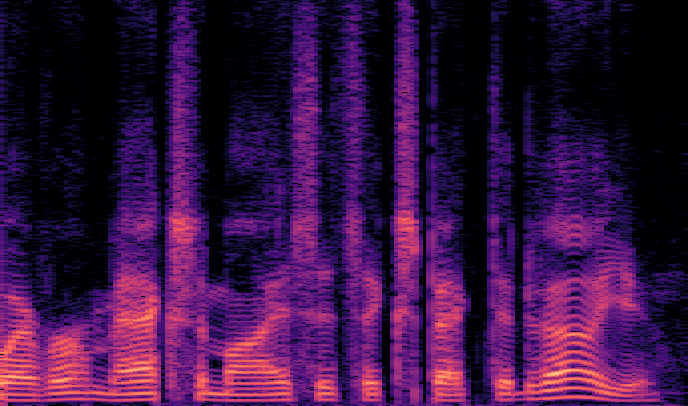
</td>
            <td>
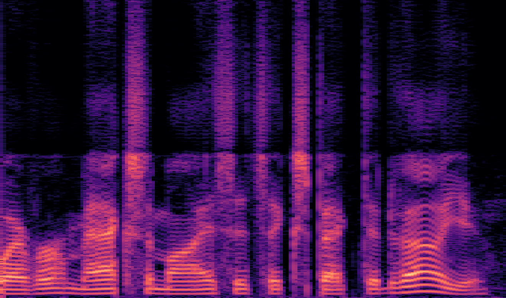
</td>
            <td>
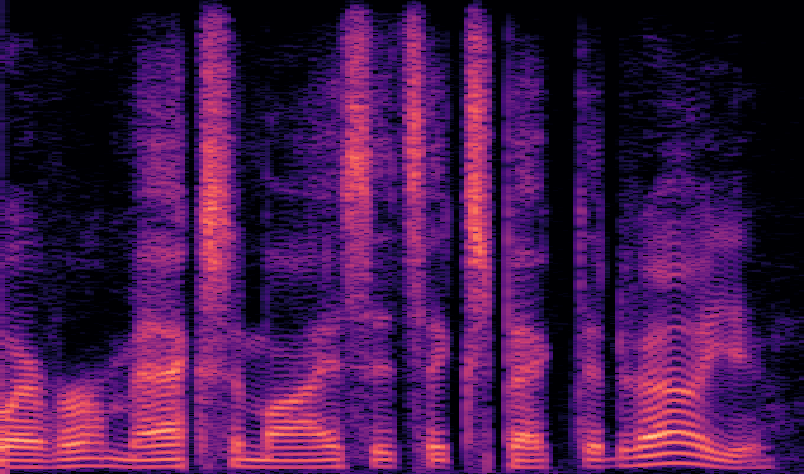
</td>
        </tr>

        <tr style="background-color: #F0EFF8;">
          <td colspan="7" style="text-align: center; padding: 6px 10px; font-weight: bold;">
            Bandwidth Extension from 8 kHz to 44.1 kHz
          </td>
        </tr>

       <tr>
            <td nowrap>
Target
</td>
            <td>
Input
</td>
            <td>
Nu-Wave2
</td>
            <td>
AP-BWE
</td>
            <td>
Fre-Painter
</td>
           <td>
FlowHigh
</td>
           <td>
CodecFlow
</td>
        </tr>

         <tr>
            <td>
                <audio controls style="width: 130px;">
                  <source src="44.1k/gt/p225_298_mic1.wav" type="audio/mpeg">
                  Your browser does not support the audio tag.
                </audio>
            </td>
            <td>
                <audio controls style="width: 130px;">
                  <source src="44.1k/input/p225_298_mic1.wav" type="audio/mpeg">
                  Your browser does not support the audio tag.
                </audio>
            </td>
            <td>
                <audio controls style="width: 130px;">
                  <source src="44.1k/nuwave2/p225_298_mic1.wav" type="audio/mpeg">
                  Your browser does not support the audio tag.
                </audio>
            </td>
            <td>
                <audio controls style="width: 130px;">
                  <source src="44.1k/APBWE/p225_298_mic1.wav" type="audio/mpeg">
                  Your browser does not support the audio tag.
                </audio>
            </td>
            <td>
                <audio controls style="width: 130px;">
                  <source src="44.1k/FrePainter/p225_298_mic1.wav" type="audio/mpeg">
                  Your browser does not support the audio tag.
                </audio>
            </td>
            <td>
                <audio controls style="width: 130px;">
                  <source src="44.1k/flowhigh/p225_298_mic1.wav" type="audio/mpeg">
                  Your browser does not support the audio tag.
                </audio>
            </td>
            <td>
                <audio controls style="width: 130px;">
                  <source src="44.1k/CodecFlow/p225_298_mic1.wav" type="audio/mpeg">
                  Your browser does not support the audio tag.
                </audio>
            </td>
        </tr>

        <tr>
            <td>

</td>
            <td>

</td>
            <td>
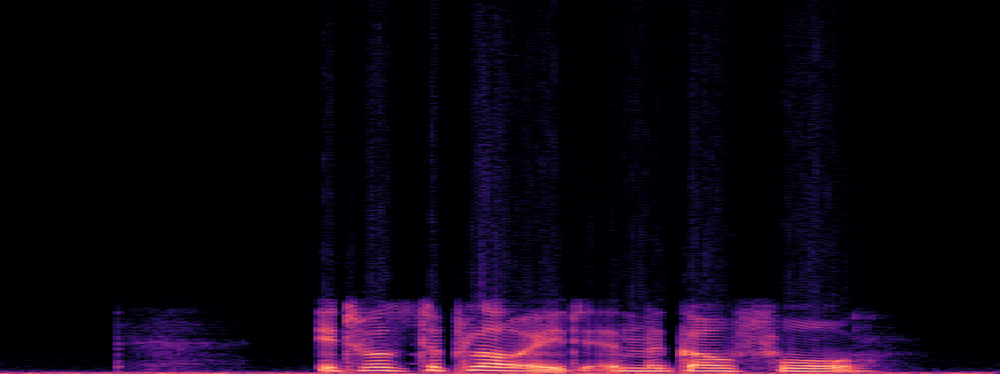
</td>
            <td>
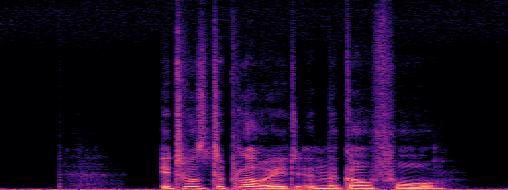
</td>
            <td>
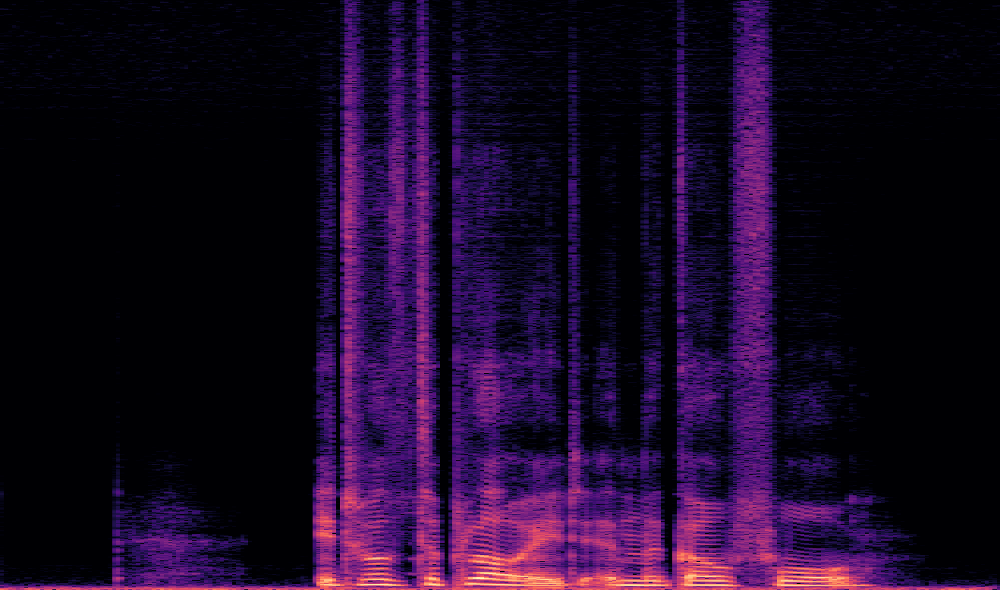
</td>
            <td>
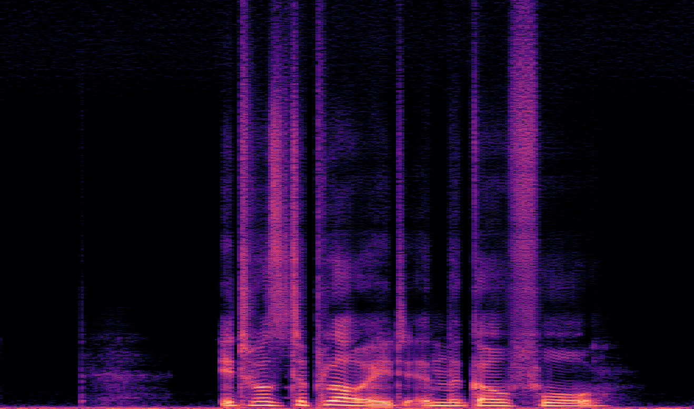
</td>
            <td>

</td>
        </tr>

        <tr>
            <td nowrap>
Target
</td>
            <td>
Input
</td>
            <td>
Nu-Wave2
</td>
            <td>
AP-BWE
</td>
            <td>
Fre-Painter
</td>
           <td>
FlowHigh
</td>
           <td>
CodecFlow
</td>
        </tr>

         <tr>
            <td>
                <audio controls style="width: 130px;">
                  <source src="44.1k/gt/p226_027_mic2.wav" type="audio/mpeg">
                  Your browser does not support the audio tag.
                </audio>
            </td>
            <td>
                <audio controls style="width: 130px;">
                  <source src="44.1k/input/p226_027_mic2.wav" type="audio/mpeg">
                  Your browser does not support the audio tag.
                </audio>
            </td>
            <td>
                <audio controls style="width: 130px;">
                  <source src="44.1k/nuwave2/p226_027_mic2.wav" type="audio/mpeg">
                  Your browser does not support the audio tag.
                </audio>
            </td>
            <td>
                <audio controls style="width: 130px;">
                  <source src="44.1k/APBWE/p226_027_mic2.wav" type="audio/mpeg">
                  Your browser does not support the audio tag.
                </audio>
            </td>
            <td>
                <audio controls style="width: 130px;">
                  <source src="44.1k/FrePainter/p226_027_mic2.wav" type="audio/mpeg">
                  Your browser does not support the audio tag.
                </audio>
            </td>
            <td>
                <audio controls style="width: 130px;">
                  <source src="44.1k/flowhigh/p226_027_mic2.wav" type="audio/mpeg">
                  Your browser does not support the audio tag.
                </audio>
            </td>
            <td>
                <audio controls style="width: 130px;">
                  <source src="44.1k/CodecFlow/p226_027_mic2.wav" type="audio/mpeg">
                  Your browser does not support the audio tag.
                </audio>
            </td>
        </tr>

        <tr>
            <td>
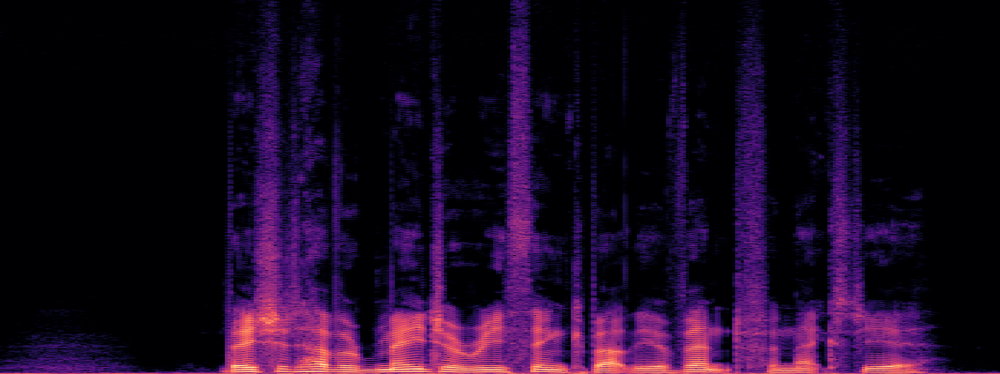
</td>
            <td>
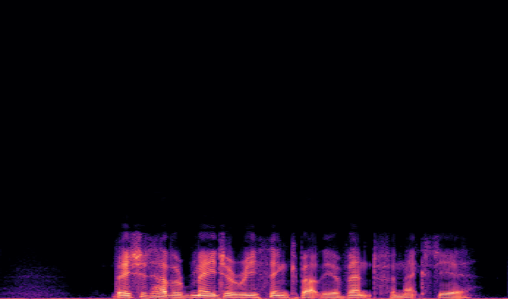
</td>
            <td>
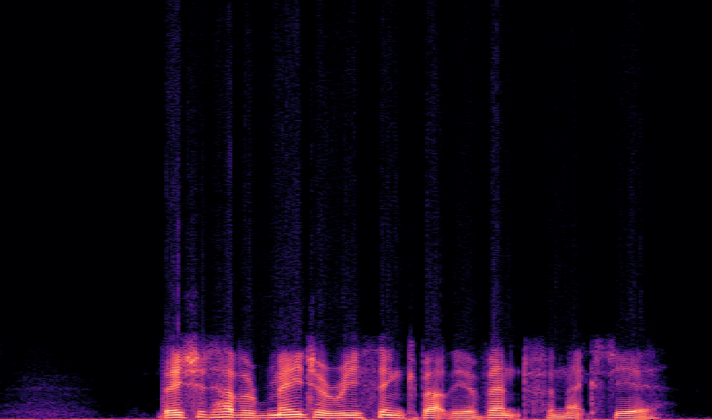
</td>
            <td>
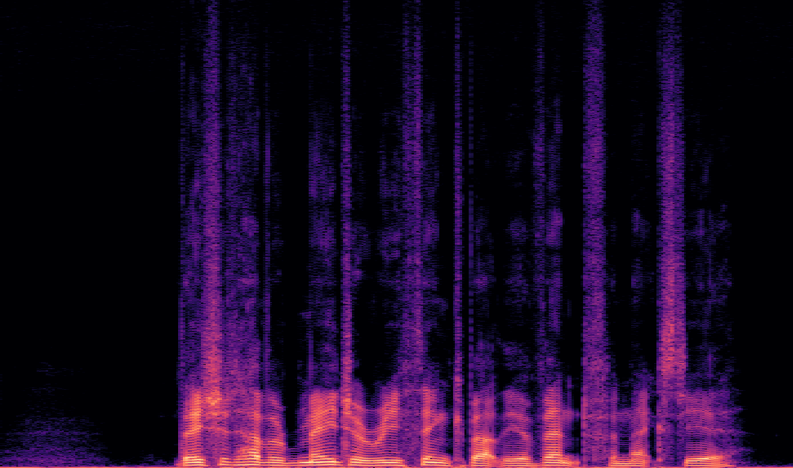
</td>
            <td>
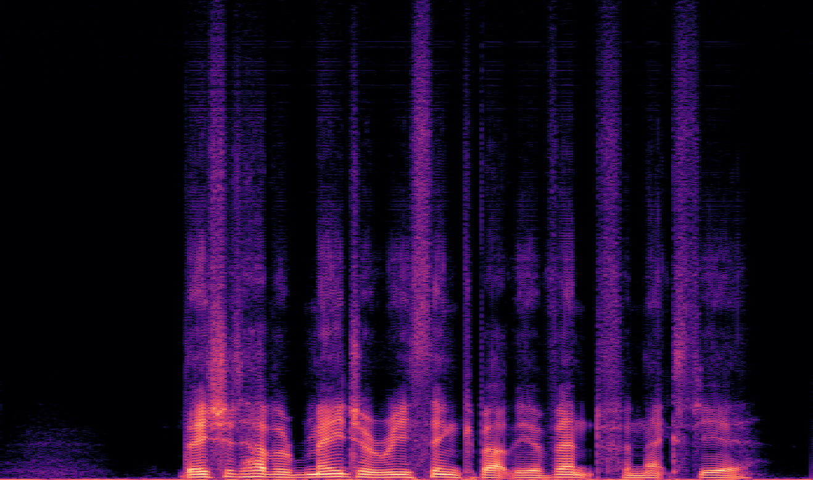
</td>
            <td>
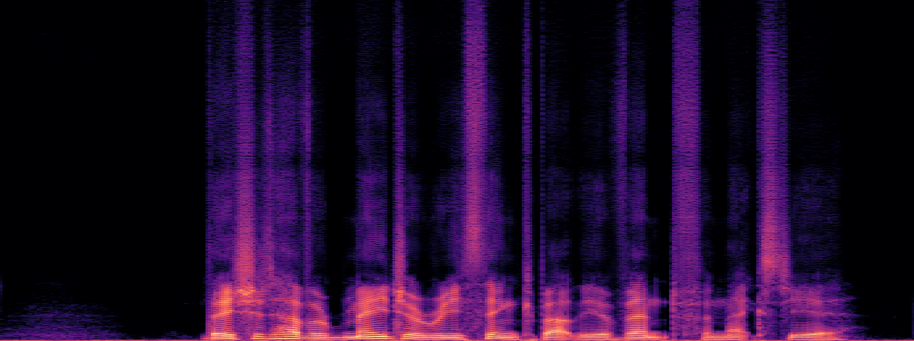
</td>
            <td>

</td>
        </tr>

    </tbody>
</table>

  
  

## Ablation Study

<table style="font-family: 'Times New Roman', 'SimSun', '宋体', serif;">
    <tbody>

        <tr style="background-color: #EAF2E8;">
          <td colspan="6" style="text-align: center; padding: 6px 10px; font-weight: bold;">
            Bandwidth Extension from 8 kHz to 16 kHz
          </td>
        </tr>

       <tr>
            <td nowrap>
Target
</td>
            <td>
Input
</td>
            <td>
CodecReg
</td>
            <td>
CFM-Conf
</td>
            <td>
CFM-UConf
</td>
           <td>
CodecFlow
</td>
        </tr>

        <tr>
            <td>
                <audio controls style="width: 130px;">
                  <source src="ablation/16k/gt/fsem0_si1828.wav" type="audio/mpeg">
                  Your browser does not support the audio tag.
                </audio>
            </td>
            <td>
                <audio controls style="width: 130px;">
                  <source src="ablation/16k/input/fsem0_si1828_8k.wav" type="audio/mpeg">
                  Your browser does not support the audio tag.
                </audio>
            </td>
            <td>
                <audio controls style="width: 130px;">
                  <source src="ablation/16k/CodecReg/fnmr0_si769_8k.wav" type="audio/mpeg">
                  Your browser does not support the audio tag.
                </audio>
            </td>
            <td>
                <audio controls style="width: 130px;">
                  <source src="ablation/16k/CFM-Conf/fsem0_si1828_8k.wav" type="audio/mpeg">
                  Your browser does not support the audio tag.
                </audio>
            </td>
            <td>
                <audio controls style="width: 130px;">
                  <source src="ablation/16k/CFM-Uconf/fsem0_si1828_8k.wav" type="audio/mpeg">
                  Your browser does not support the audio tag.
                </audio>
            </td>
            <td>
                <audio controls style="width: 130px;">
                  <source src="ablation/16k/CodecFlow/fsem0_si1828.wav" type="audio/mpeg">
                  Your browser does not support the audio tag.
                </audio>
            </td>
        </tr>

        <tr>
            <td>
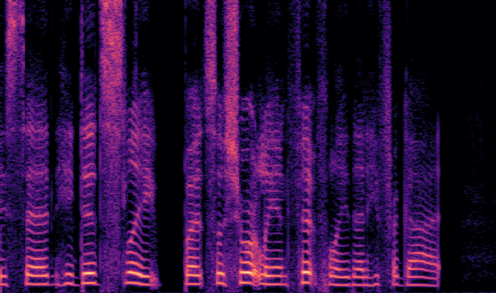
</td>
            <td>
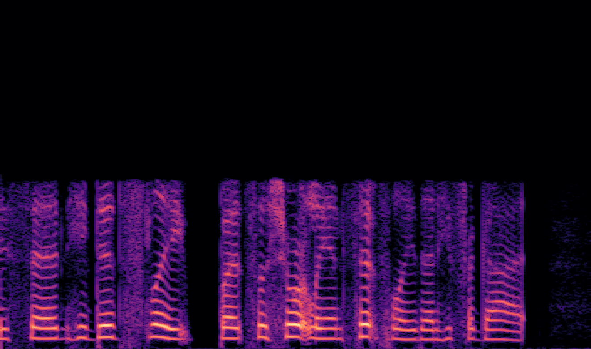
</td>
            <td>
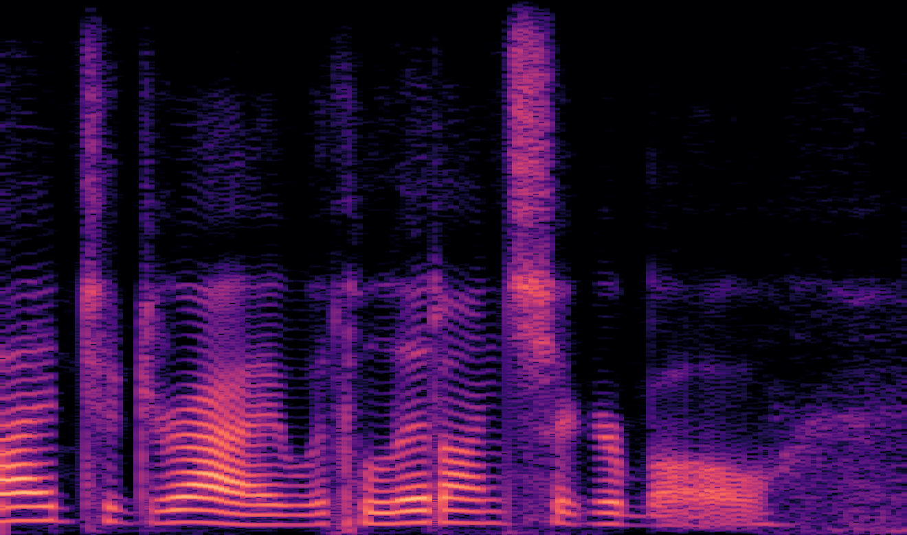
</td>
            <td>
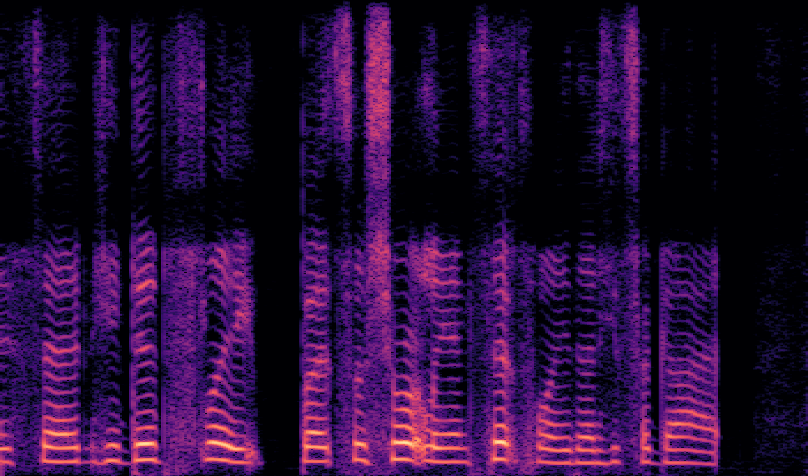
</td>
            <td>
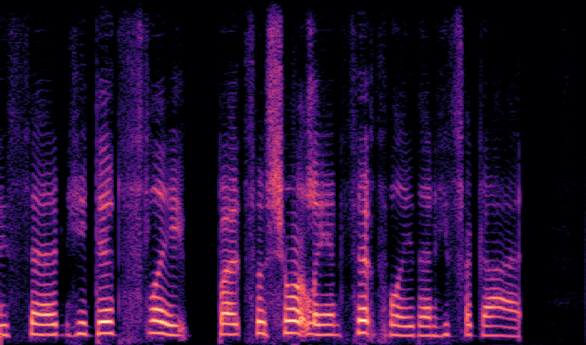
</td>
            <td>

</td>
        </tr>

        <tr>
            <td>
                <audio controls style="width: 130px;">
                  <source src="ablation/16k/gt/mbdg0_si1463.wav" type="audio/mpeg">
                  Your browser does not support the audio tag.
                </audio>
            </td>
            <td>
                <audio controls style="width: 130px;">
                  <source src="ablation/16k/input/mbdg0_si1463_8k.wav" type="audio/mpeg">
                  Your browser does not support the audio tag.
                </audio>
            </td>
            <td>
                <audio controls style="width: 130px;">
                  <source src="ablation/16k/CodecReg/mbdg0_si1463_8k.wav" type="audio/mpeg">
                  Your browser does not support the audio tag.
                </audio>
            </td>
            <td>
                <audio controls style="width: 130px;">
                  <source src="ablation/16k/CFM-Conf/mbdg0_si1463_8k.wav" type="audio/mpeg">
                  Your browser does not support the audio tag.
                </audio>
            </td>
            <td>
                <audio controls style="width: 130px;">
                  <source src="ablation/16k/CFM-Uconf/mbdg0_si1463_8k.wav" type="audio/mpeg">
                  Your browser does not support the audio tag.
                </audio>
            </td>
            <td>
                <audio controls style="width: 130px;">
                  <source src="ablation/16k/CodecFlow/mbdg0_si1463_8k.wav" type="audio/mpeg">
                  Your browser does not support the audio tag.
                </audio>
            </td>
        </tr>

        <tr>
            <td>

</td>
            <td>

</td>
            <td>
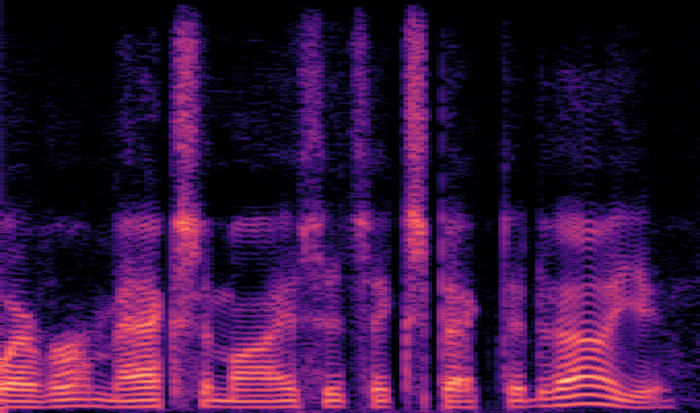
</td>
            <td>
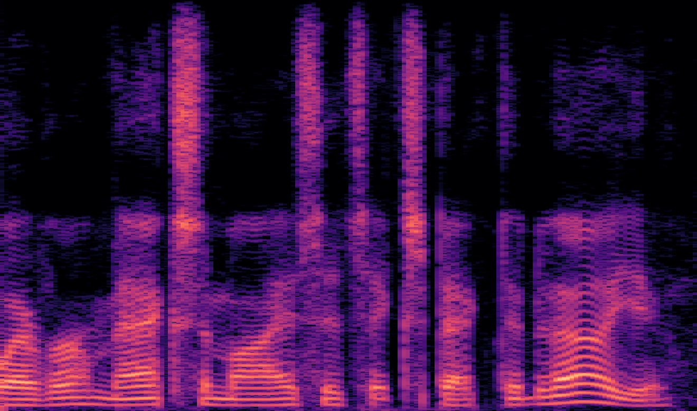
</td>
            <td>
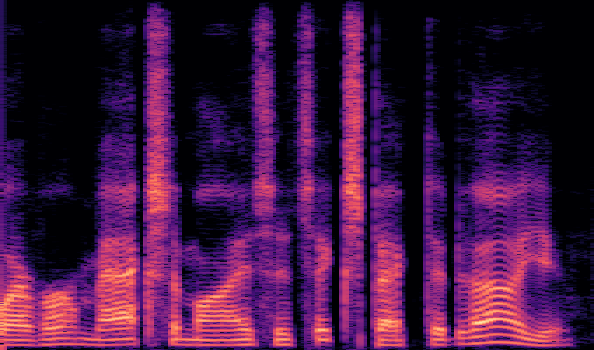
</td>
            <td>

</td>
        </tr>

        <tr style="background-color: #EAF2E8;">
          <td colspan="6" style="text-align: center; padding: 6px 10px; font-weight: bold;">
            Bandwidth Extension from 8 kHz to 44.1 kHz
          </td>
        </tr>

       <tr>
            <td nowrap>
Target
</td>
            <td>
Input
</td>
            <td>
CodecReg
</td>
            <td>
CFM-Conf
</td>
            <td>
CFM-UConf
</td>
           <td>
CodecFlow
</td>
        </tr>

        <tr>
            <td>
                <audio controls style="width: 130px;">
                  <source src="ablation/44.1k/gt/p225_298_mic1.wav" type="audio/mpeg">
                  Your browser does not support the audio tag.
                </audio>
            </td>
            <td>
                <audio controls style="width: 130px;">
                  <source src="ablation/44.1k/input/p225_298_mic1.wav" type="audio/mpeg">
                  Your browser does not support the audio tag.
                </audio>
            </td>
            <td>
                <audio controls style="width: 130px;">
                  <source src="ablation/44.1k/CodecReg/p225_298_mic1.wav" type="audio/mpeg">
                  Your browser does not support the audio tag.
                </audio>
            </td>
            <td>
                <audio controls style="width: 130px;">
                  <source src="ablation/44.1k/CFM-Conf/p225_298_mic1.wav" type="audio/mpeg">
                  Your browser does not support the audio tag.
                </audio>
            </td>
            <td>
                <audio controls style="width: 130px;">
                  <source src="ablation/44.1k/CFM-Uconf/p225_298_mic1.wav" type="audio/mpeg">
                  Your browser does not support the audio tag.
                </audio>
            </td>
            <td>
                <audio controls style="width: 130px;">
                  <source src="ablation/44.1k/CodecFlow/p225_298_mic1.wav" type="audio/mpeg">
                  Your browser does not support the audio tag.
                </audio>
            </td>
        </tr>

        <tr>
            <td>
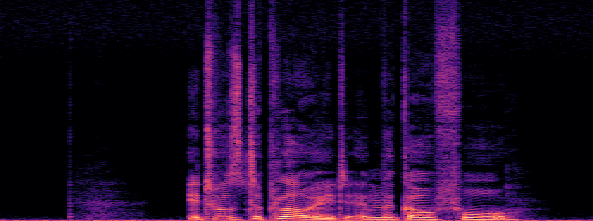
</td>
            <td>
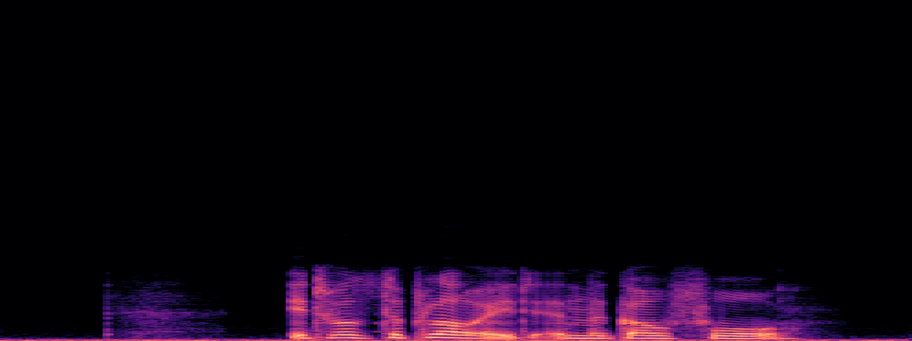
</td>
            <td>
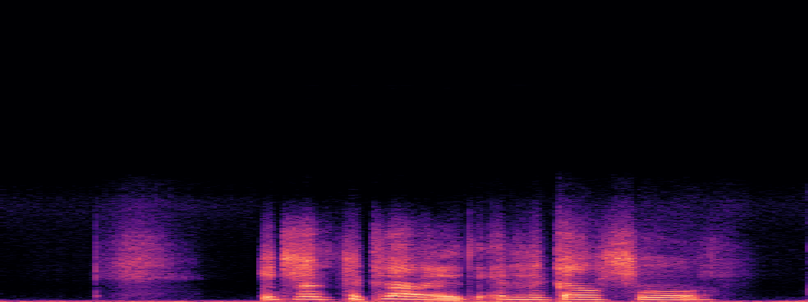
</td>
            <td>
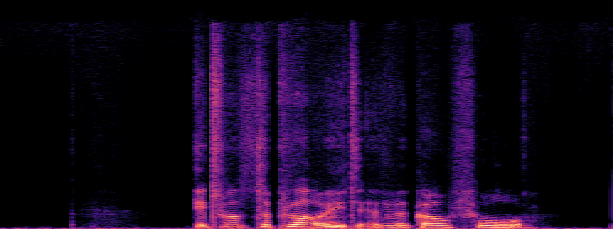
</td>
            <td>
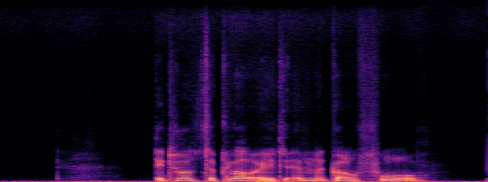
</td>
            <td>
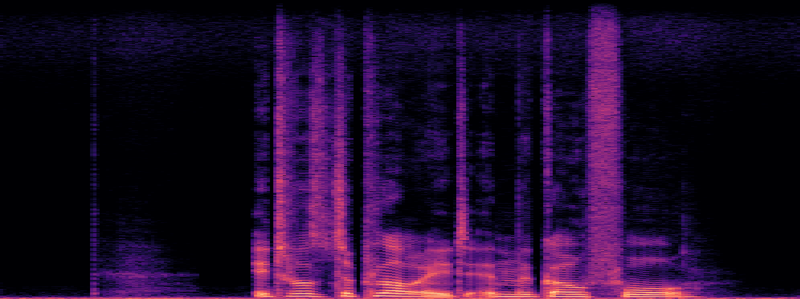
</td>
        </tr>

        <tr>
            <td>
                <audio controls style="width: 130px;">
                  <source src="ablation/44.1k/gt/p226_027_mic2.wav" type="audio/mpeg">
                  Your browser does not support the audio tag.
                </audio>
            </td>
            <td>
                <audio controls style="width: 130px;">
                  <source src="ablation/44.1k/input/p226_027_mic2.wav" type="audio/mpeg">
                  Your browser does not support the audio tag.
                </audio>
            </td>
            <td>
                <audio controls style="width: 130px;">
                  <source src="ablation/44.1k/CodecReg/p226_027_mic2.wav" type="audio/mpeg">
                  Your browser does not support the audio tag.
                </audio>
            </td>
            <td>
                <audio controls style="width: 130px;">
                  <source src="ablation/44.1k/CFM-Conf/p226_027_mic2.wav" type="audio/mpeg">
                  Your browser does not support the audio tag.
                </audio>
            </td>
            <td>
                <audio controls style="width: 130px;">
                  <source src="ablation/44.1k/CFM-Uconf/p226_027_mic2.wav" type="audio/mpeg">
                  Your browser does not support the audio tag.
                </audio>
            </td>
            <td>
                <audio controls style="width: 130px;">
                  <source src="ablation/44.1k/CodecFlow/p226_027_mic2.wav" type="audio/mpeg">
                  Your browser does not support the audio tag.
                </audio>
            </td>
        </tr>

        <tr>
            <td>

</td>
            <td>

</td>
            <td>
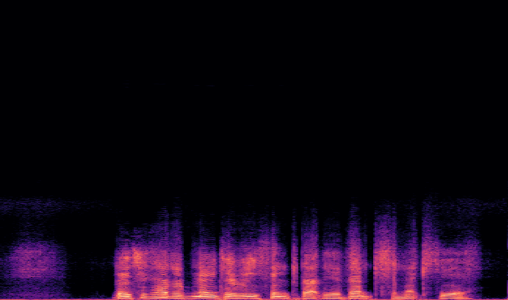
</td>
            <td>
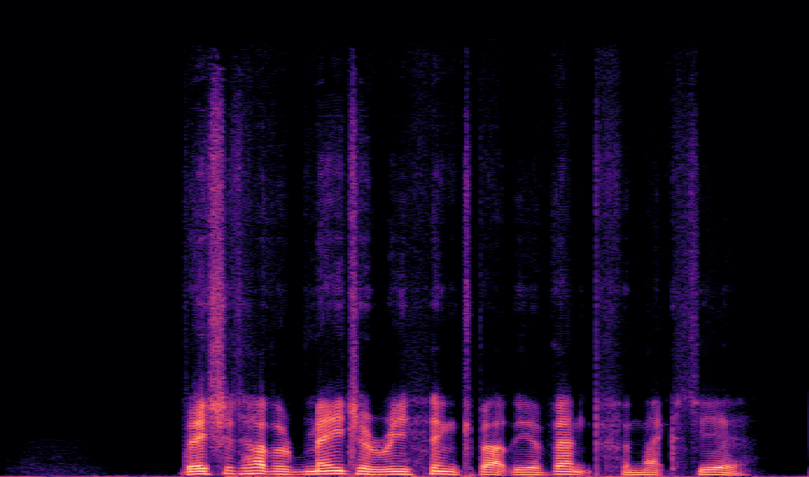
</td>
            <td>

</td>
            <td>
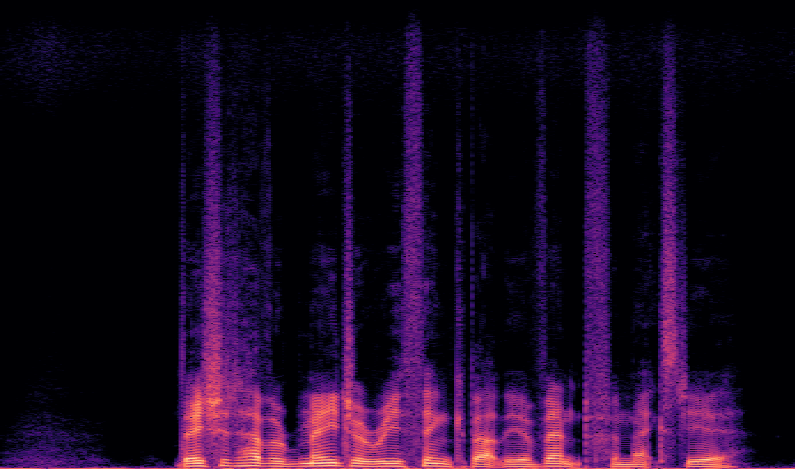
</td>
        </tr>

    </tbody>
</table>

  
  

  
