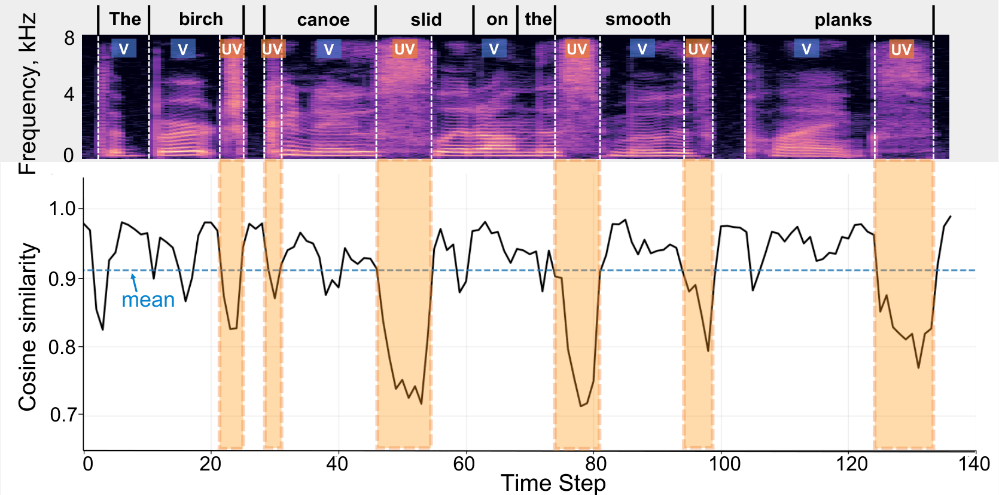
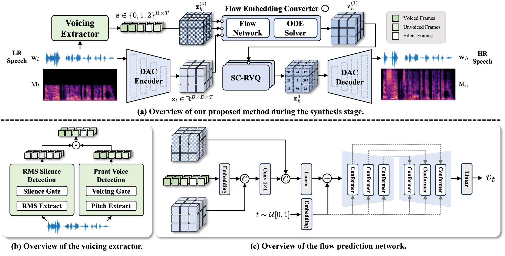
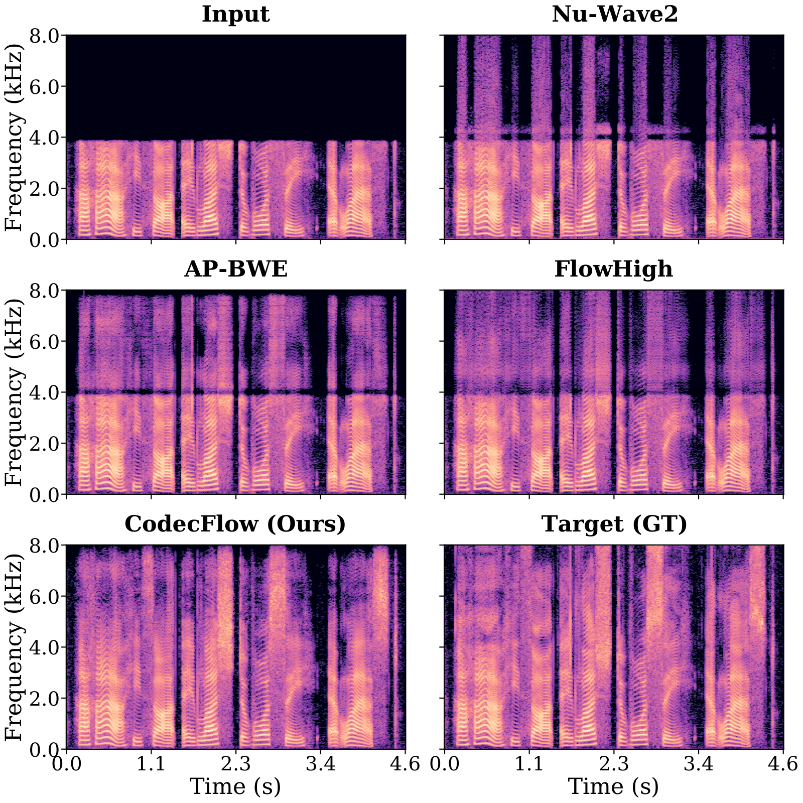
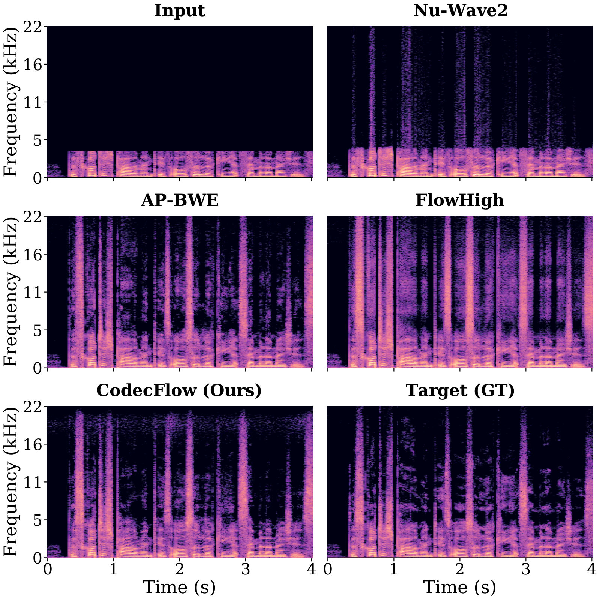

<header class="hero">
  Neural speech bandwidth extension
  <h1>CodecFlow</h1>
  
Efficient Bandwidth Extension via Conditional Flow Matching in Neural Codec Latent Space

  <ul class="authors" aria-label="Authors">
    <li>Bowen Zhang</li>
    <li>Junchuan Zhao</li>
    <li>Ian McLoughlin</li>
    <li>Ye Wang</li>
    <li>A S Madhukumar</li>
  </ul>
  
Research demo · Speech &amp; Audio Intelligence

</header>

<section class="content-section" id="overview">
  

    
Overview<h2>Abstract</h2>

    
Speech Bandwidth Extension improves clarity and intelligibility by restoring/inferring appropriate high-frequency content for low-bandwidth speech. Existing methods often rely on spectrogram or waveform modeling, which can incur higher computational cost and have limited high-frequency fidelity. Neural audio codecs offer compact latent representations that better preserve acoustic detail, yet accurately recovering high-resolution latent information remains challenging due to representation mismatch. We present CodecFlow, a neural codec-based BWE framework that performs efficient speech reconstruction in a compact latent space. CodecFlow employs a voicing-aware conditional flow converter on continuous codec embeddings and a structure-constrained residual vector quantizer to improve latent alignment stability. Optimized end-to-end, CodecFlow achieves strong spectral fidelity and enhanced perceptual quality on 8 kHz to 16 kHz and 44.1 kHz speech BWE tasks.

  

</section>

<section class="content-section" id="method">
  

    
Architecture<h2>Method</h2>

  

  <figure class="figure-card">
    
    <figcaption><strong>V/UV segmentation and LR–HR embedding cosine similarity over time.</strong> Orange regions mark unvoiced-aligned drops; the blue line shows the global mean.</figcaption>
  </figure>
  <figure class="figure-card">
    
    <figcaption><strong>CodecFlow framework.</strong> Overall pipeline, voicing extractor, and flow prediction network within the flow embedding converter.</figcaption>
  </figure>
</section>

<section class="content-section" id="results">
  

    
Results<h2>Visible high-frequency recovery.</h2>

    
Spectrograms show the restored frequency structure across both target bandwidths, alongside representative baselines.

  

  

    <figure class="figure-card"><figcaption><strong>8→16 kHz.</strong> Input, ground truth, baseline systems, and CodecFlow.</figcaption></figure>
    <figure class="figure-card"><figcaption><strong>8→44.1 kHz.</strong> Input, ground truth, baseline systems, and CodecFlow.</figcaption></figure>
  

</section>

<section class="content-section" id="baseline">
  

    
Listening test 01<h2>Baseline comparison.</h2>

    
CodecFlow is highlighted in violet and placed last for a natural baseline-to-proposed reading order. Every system remains visible in the responsive grid.

  

  {% include comparison.html sample="Sample 01" title="8→16 kHz · —Scroll Left and Right for 8→16kHz comparisons—" base="16k" methods="Target|Input|Nu-Wave2|AP-BWE|Fre-Painter|FlowHigh|CodecFlow" folders="gt|input|nuwave2|APBWE|FrePainter|flowhigh|CodecFlow" audio_files="fsem0_si1828.wav|fsem0_si1828_8k.wav|fsem0_si1828_nuwave2.wav|fsem0_si1828_8k.wav|fsem0_si1828_8k.wav|fsem0_si1828_8k.wav|fsem0_si1828.wav" image_files="fsem0_si1828.png|fsem0_si1828_8k.png|fsem0_si1828_nuwave2.png|fsem0_si1828_8k.png|fsem0_si1828_8k.png|fsem0_si1828_8k.png|fsem0_si1828.png" %}
  {% include comparison.html sample="Sample 02" title="8→16 kHz · —Scroll Left and Right for 8→16kHz comparisons—" base="16k" methods="Target|Input|Nu-Wave2|AP-BWE|Fre-Painter|FlowHigh|CodecFlow" folders="gt|input|nuwave2|APBWE|FrePainter|flowhigh|CodecFlow" audio_files="mbdg0_si1463.wav|mbdg0_si1463_8k.wav|mbdg0_si1463_nuwave2.wav|mbdg0_si1463_8k.wav|mbdg0_si1463_8k.wav|mbdg0_si1463_8k.wav|mbdg0_si1463.wav" image_files="mbdg0_si1463.png|mbdg0_si1463_8k.png|mbdg0_si1463_nuwave2.png|mbdg0_si1463_8k.png|mbdg0_si1463_8k.png|mbdg0_si1463_8k.png|mbdg0_si1463.png" %}
  {% include comparison.html sample="Sample 01" title="8→44.1 kHz · —Scroll Left and Right for 8→44.1kHz comparisons—" base="44.1k" methods="Target|Input|Nu-Wave2|AP-BWE|Fre-Painter|FlowHigh|CodecFlow" folders="gt|input|nuwave2|APBWE|FrePainter|flowhigh|CodecFlow" audio_files="p225_298_mic1.wav|p225_298_mic1.wav|p225_298_mic1.wav|p225_298_mic1.wav|p225_298_mic1.wav|p225_298_mic1.wav|p225_298_mic1.wav" image_files="p225_298_mic1.png|p225_298_mic1.png|p225_298_mic1.png|p225_298_mic1.png|p225_298_mic1.png|p225_298_mic1.png|p225_298_mic1.png" %}
  {% include comparison.html sample="Sample 02" title="8→44.1 kHz · —Scroll Left and Right for 8→44.1kHz comparisons—" base="44.1k" methods="Target|Input|Nu-Wave2|AP-BWE|Fre-Painter|FlowHigh|CodecFlow" folders="gt|input|nuwave2|APBWE|FrePainter|flowhigh|CodecFlow" audio_files="p226_027_mic2.wav|p226_027_mic2.wav|p226_027_mic2.wav|p226_027_mic2.wav|p226_027_mic2.wav|p226_027_mic2.wav|p226_027_mic2.wav" image_files="p226_027_mic2.png|p226_027_mic2.png|p226_027_mic2.png|p226_027_mic2.png|p226_027_mic2.png|p226_027_mic2.png|p226_027_mic2.png" %}
</section>

<section class="content-section" id="ablation">
  

    
Listening test 02<h2>Ablation study.</h2>

    
Compare the complete CodecFlow system against variants that remove or alter individual modeling choices.

  

  
  
  
  
</section>

CodecFlow · Interactive research demo for speech bandwidth extension.

